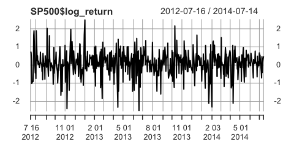
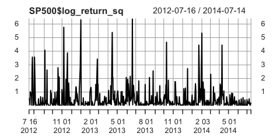

### Prob-3

In this problem we consider some numerical examples of Problem-2. Recall Eqs. (1) and (2), and assume that *κ*<sub>*v*</sub> = 3, *ϕ* ∈ {0.3, 0.6, 0.9}, and *σ*<sub>*ξ*</sub><sup>2</sup> ∈ {0.3, 0.9, 1.8}
(a) For each pair of (*ϕ*, *σ*<sub>*ξ*</sub><sup>2</sup>) compute *C**o**r**r*\[*y*<sub>*t*</sub><sup>2</sup>, *y*<sub>*t* − *h*</sub><sup>2</sup>\] with *h* = 1, 2, 3, 4 (i.e. fill out Table 1)

First, I create a placeholder matrix

``` r
# set-up
h4=c('h=1', 'h=2', 'h=3', 'h=4') # column names
phi_sigmaSq=c('(0.3, 0.3)', '(0.6, 0.3)', '(0.9, 0.3)',  # rownames
              '(0.3, 0.9)', '(0.6, 0.9)', '(0.9, 0.9)',
              '(0.3, 1.8)', '(0.6, 1.8)', '(0.9, 1.8)')
Table1=matrix(NA, 9,4,dimnames = list(phi_sigma=phi_sigmaSq,h4))
```

Then I define a helper function for correlation computed as
Notice this is a fuction of *κ*, *ϕ*, *σ*<sub>*ξ*</sub><sup>2</sup> and *h*

``` r
# helper function
corr= function(sigmaSq, phi, h, kappa){
  num = exp(sigmaSq*(phi^h)/(1-phi^2))-1 #numerator
  denom =  kappa* (exp(sigmaSq/(1-phi^2))) -1 #denominator
  corr= num/denom
  return(corr)}
```

Now we can plug *κ*, *ϕ*, *σ*<sub>*ξ*</sub><sup>2</sup> and *h* to the function defined above and fill out Table1.

``` r
kappa=3
sigmaSq_option=c(0.3,0.9,1.8)
phi_option=c(0.3,0.6,0.9)

for (i in 1:3){
  sigmaSq=sigmaSq_option[i]
  for(j in 1:3){
    phi=phi_option[j]
    for(h in 1:4){
      Corr=corr(sigmaSq, phi, h, kappa)
      Table1[(3*(i-1)+j),h]=Corr}}}
knitr::kable(Table1,digits = 5)
```

|            |      h=1|      h=2|      h=3|      h=4|
|------------|--------:|--------:|--------:|--------:|
| (0.3, 0.3) |  0.03278|  0.00950|  0.00282|  0.00084|
| (0.6, 0.3) |  0.08561|  0.04845|  0.02808|  0.01651|
| (0.9, 0.3) |  0.23185|  0.19136|  0.15953|  0.13416|
| (0.3, 0.9) |  0.04889|  0.01318|  0.00383|  0.00114|
| (0.6, 0.9) |  0.11787|  0.05863|  0.03157|  0.01778|
| (0.9, 0.9) |  0.20525|  0.13299|  0.08968|  0.06264|
| (0.3, 1.8) |  0.03917|  0.00942|  0.00265|  0.00078|
| (0.6, 1.8) |  0.09000|  0.03580|  0.01707|  0.00898|
| (0.9, 1.8) |  0.12923|  0.05508|  0.02555|  0.01280|

1.  Comment on Table 1 from a viewpoint of volatility persistence

-   Larger *ϕ* leads to higher persistence (Recall log*σ*<sub>*t*</sub><sup>2</sup> = *μ* + *ϕ*(log*σ*<sub>*t* − 1</sub><sup>2</sup>−*μ*) + *ξ*<sub>*t*</sub>)
-   The level of correlation is relatively small even when *ϕ* is large (e.g *ϕ* = 0.9) and decreases relatively fast

1.  For comparison, consider a GARCH(1,1) process:

Define
As we learned in class, if *δ*(*α*, *β*)&lt;1,then Corr\[*y*<sub>*t*</sub><sup>2</sup>,*y*<sub>*t* − *h*</sub><sup>2</sup>\] is well defined and given by
First, I create a placeholder matrix and helper function as I did in (a)

``` r
# GARCH setup
alpha_beta= c('(0.2, 0.5)', '(0.4, 0.1)', '(0.21, 0.71)', '(0.3, 0.6)','(0.5, 0.2)') 
Table2= matrix(NA, 5,5,dimnames = list(alpha_beta=alpha_beta, c('delta', h4))) # placeholder

delta= function(alpha, beta){ # helper function for (*)
  return(3*(alpha^2)+ beta^2 + 2*alpha*beta)}

# GARCH funciton
Corr_garch= function(alpha, beta, h){ # helper function for (**)
  return((alpha*(1-(beta*(alpha+beta)))/(1-2*alpha*beta-beta^2))*((alpha+beta)^(h-1)))}
```

Then plug (*α*, *β*)=(0.2, 0.5),(0.4, 0.1),(0.21, 0.71),(0.3, 0.6) and (0.5, 0.2) and we get Table 2

``` r
alpha_option=c(0.2,0.4,0.21,0.3,0.5)
beta_option= c(0.5, 0.1,0.71,0.6,0.2)

for (i in 1:5){
  alpha=alpha_option[i]
  beta= beta_option[i]
  
  Table2[i, 1]= delta(alpha, beta)
  
  for (h in 1:4){
    corr_i = Corr_garch(alpha, beta, h)
    Table2[i, h+1]= corr_i
  }
}
knitr::kable(Table2, digits = 4)
```

|              |   delta|     h=1|     h=2|     h=3|     h=4|
|--------------|-------:|-------:|-------:|-------:|-------:|
| (0.2, 0.5)   |  0.5700|  0.2364|  0.1655|  0.1158|  0.0811|
| (0.4, 0.1)   |  0.5700|  0.4176|  0.2088|  0.1044|  0.0522|
| (0.21, 0.71) |  0.9346|  0.3684|  0.3389|  0.3118|  0.2869|
| (0.3, 0.6)   |  0.9900|  0.4929|  0.4436|  0.3992|  0.3593|
| (0.5, 0.2)   |  0.9900|  0.5658|  0.3961|  0.2772|  0.1941|

1.  Compare the volatility persistence of SV and GARCH based on Tables 1 and 2

-   learger value of *α* and *β* result in higher persistence in GARCH
-   When *α* + *β* is large, GARCH model shows high correlation and it doesn't decrease much as h increases
-   Overall, persistence is higher in GARCH than in SV

### Prob-4

In this problem we study empirical examples related with Problem-3. See [Federal Reserve Economic Data](https://fred.stlouisfed.org/)
Download daily S&P 500 Index (not seasonally adjusted) from July 16, 2012 through July 14, 2014 (501 observations). Call it {*x*<sub>*t*</sub>}.

We first import data directly from FRED using `getSymbol` function in `quantmod` library, select the time period and remove missing values

``` r
# Import data
quantmod::getSymbols('SP500', src = 'FRED', auto.assign = T)
SP500= SP500['2012-07-16/2014-07-14']
SP500= SP500[!is.na(SP500)]
```

Then I add two variables, log-return and squared log-return to the dataframe. Log-return is calculated in percentage to avoid very small values. I show first six observations to make sure that transformation is correct.

``` r
SP500$log_return = round((log(SP500$SP500)-lag(log(SP500$SP500)))*100, 2) # per cent, two digits
SP500$log_return_sq = SP500$log_return^2
head(SP500)
```

    ##              SP500 log_return log_return_sq
    ## 2012-07-16 1353.64         NA            NA
    ## 2012-07-17 1363.67       0.74        0.5476
    ## 2012-07-18 1372.78       0.67        0.4489
    ## 2012-07-19 1376.51       0.27        0.0729
    ## 2012-07-20 1362.66      -1.01        1.0201
    ## 2012-07-23 1350.52      -0.89        0.7921

1.  Draw a time series plot of the log-return series *y*<sub>*t*</sub> = log*x*<sub>*t*</sub> − log*x*<sub>*t* − 1</sub>

``` r
xts::plot.xts(SP500$log_return)
```



``` r
xts::plot.xts(SP500$log_return_sq)
```



1.  Compute sample autocorrelation of {*y*<sub>*t*</sub><sup>2</sup>} at lags 1-4, denoted by $\\{ \\hat{\\rho }\_{ y^{2} ,1} , \\hat{\\rho}\_{y^2 ,2} ,\\hat { \\rho } \_ { y ^2 ,3} ,\\hat { \\rho } \_ { y ^2 ,4} \\}$

Recall that $Var\[y\_t\]= (1/T)E\[\\sum\_{t=1}^T(y\_t-E\[y\_t\])^2\], Cov\[y\_t, y\_{t-h}\]=(1/T)E\[\\sum\_{t=1}^T(y\_t-E\[y\_t\])(y\_{t-h}-E\[y\_{t-h}\])\]$ and *C**o**r**r*\[*y*<sub>*t*</sub>, *y*<sub>*t* − *h*</sub>\]=*C**o**v*\[*y*<sub>*t*</sub>, *y*<sub>*t* − *h*</sub>\]. Therefore sample correlation for *h* = 1, 2, 3, 4 are:

``` r
corr=numeric(4) # empty vector
cov=numeric(4)

mean=mean(SP500$log_return_sq, na.rm=T)
var=mean((SP500$log_return_sq-mean)^2, na.rm=T)
for (h in 1:4){
  cov[h]=mean((SP500$log_return_sq-mean)*(lag(SP500$log_return_sq, k=h) - mean), na.rm=T)
}
corr=cov/var
corr
```

    ## [1] 0.10553097 0.03530987 0.07924055 0.06387127

1.  In view of Tables 1 and 2, which do you think is a better fit for $\\{ \\hat{\\rho }\_{ y^{2} ,1} , \\hat{\\rho}\_{y^2 ,2} ,\\hat { \\rho } \_ { y ^2 ,3} ,\\hat { \\rho } \_ { y ^2 ,4} \\}$: SV or GARCH?

From the result of (c), we can say that {*y*<sub>*t*</sub>} has relatively high persistence. Recall that GARCH model better fits the series with high persistence, as we have seen in Prob3-(d). Therefore, GARCH model is the better model for our SP500 series.
