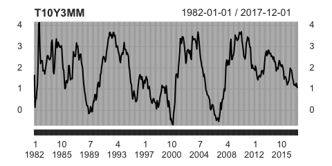

### Problem 6

First, I import the data directly from FRED using `getSymbols` function of [quantmod](https://cran.r-project.org/web/packages/quantmod/quantmod.pdf)

``` r
library(quantmod)

getSymbols('T10Y3MM',src='FRED') # monthly observation from 1982-01-01 to 2018-03-01
T10Y3MM= T10Y3MM['/2017-12-01'] # select end period
```

``` r
head(T10Y3MM) # show head
```

    ##            T10Y3MM
    ## 1982-01-01    1.67
    ## 1982-02-01    0.15
    ## 1982-03-01    0.55
    ## 1982-04-01    0.53
    ## 1982-05-01    0.91
    ## 1982-06-01    1.22

``` r
tail(T10Y3MM) # show tail
```

    ##            T10Y3MM
    ## 2017-07-01    1.23
    ## 2017-08-01    1.18
    ## 2017-09-01    1.15
    ## 2017-10-01    1.27
    ## 2017-11-01    1.10
    ## 2017-12-01    1.06

1.  Draw a time series plot of the original monthly series {*y*<sub>*t*</sub>}

``` r
plot(T10Y3MM)
```



1.  Modify the series so that

<!-- -->

1.  *x*<sub>*τ*</sub> = *y*<sub>3*τ*</sub>
2.  $x\_ \\tau = (1/3) \\sum\_{j=1}^3 y\_{3\\tau+1-j}$
3.  *x*<sub>*τ*</sub> = *y*<sub>12*τ*</sub>
4.  $x\_\\tau=(1/12)\\sum\_{j=1}^{12} y\_{12\\tau+1-j}$

``` r
quat=3*1:(length(T10Y3MM)/3) # 3,6,9,...
quatStock=T10Y3MM[quat] # Stock aggregate, quartely
year=12*1:(length(T10Y3MM)/12) # 12,24,...
yearStock=T10Y3MM[year] # SA, yearly
```

``` r
# flow aggregate, quartely
quatFlow=as.xts(ts(NA, start = c(1982,1),end = c(2017,4), frequency=4)) 
for (i in 1:length(quatFlow)){
  quatFlow[i]=(T10Y3MM[[3*i]]+T10Y3MM[[3*i-1]]+T10Y3MM[[3*i-2]])/3
}
head(quatFlow)
```

    ##              [,1]
    ## 1982 Q1 0.7900000
    ## 1982 Q2 0.8866667
    ## 1982 Q3 3.4333333
    ## 1982 Q4 2.4933333
    ## 1983 Q1 2.1733333
    ## 1983 Q2 1.8266667

``` r
# flow aggregate, yearly
yearFlow=as.xts(ts(NA, start=1982, end=2017))
for(i in 1:length(yearFlow)){
  yearFlow[i]=(T10Y3MM[[12*i]]+T10Y3MM[[12*i-1]]+T10Y3MM[[12*i-2]]+T10Y3MM[[12*i-3]]+T10Y3MM[[12*i-4]]+T10Y3MM[[12*i-5]]+T10Y3MM[[12*i-6]]+T10Y3MM[[12*i-7]]+T10Y3MM[[12*i-8]]+T10Y3MM[[12*i-9]]+T10Y3MM[[12*i-10]]+T10Y3MM[[12*i-11]])/12
}
head(yearFlow)
```

    ##                [,1]
    ## 1982-01-01 1.900833
    ## 1983-01-01 2.160833
    ## 1984-01-01 2.540833
    ## 1985-01-01 2.892500
    ## 1986-01-01 1.527500
    ## 1987-01-01 2.421667

``` r
plot(quatStock) # type1
```


``` r
plot(quatFlow) # type2
```


``` r
plot(yearStock) # type3
```


``` r
plot(yearFlow) # type4
```


1.  Coompute sample autocorrelation at lags 1,2,3 and 4 for the original series and four aggSeries in b

``` r
acf(T10Y3MM, plot = F)[1:4] # original series
```

    ## 
    ## Autocorrelations of series 'T10Y3MM', by lag
    ## 
    ##     1     2     3     4 
    ## 0.966 0.911 0.861 0.813

``` r
acf(quatStock, plot = F)[1:4] # stock aggegate, quartely
```

    ## 
    ## Autocorrelations of series 'quatStock', by lag
    ## 
    ##     1     2     3     4 
    ## 0.845 0.691 0.554 0.398

``` r
acf(quatFlow, plot=F)[1:4] # flow aggregate, quately
```

    ## 
    ## Autocorrelations of series 'quatFlow', by lag
    ## 
    ##      1      2      3      4 
    ##  0.435 -0.048 -0.376 -0.398

``` r
acf(yearStock,plot=F)[1:4] # SA, yearly
```

    ## 
    ## Autocorrelations of series 'yearStock', by lag
    ## 
    ##      1      2      3      4 
    ##  0.411 -0.003 -0.353 -0.400

``` r
acf(yearFlow,plot=F)[1:4] # FA, yearly
```

    ## 
    ## Autocorrelations of series 'yearFlow', by lag
    ## 
    ##      1      2      3      4 
    ##  0.533 -0.041 -0.407 -0.461

1.  The results suggest that autocorrelation is biggest for the original monthly data and the persistence decreases when data is aggregated. Also, when I compare stock aggregate and flow aggregate in the quartely data, persistence is higher in stock aggregate, which is consistent with the finding in Problem 1 and 2.
